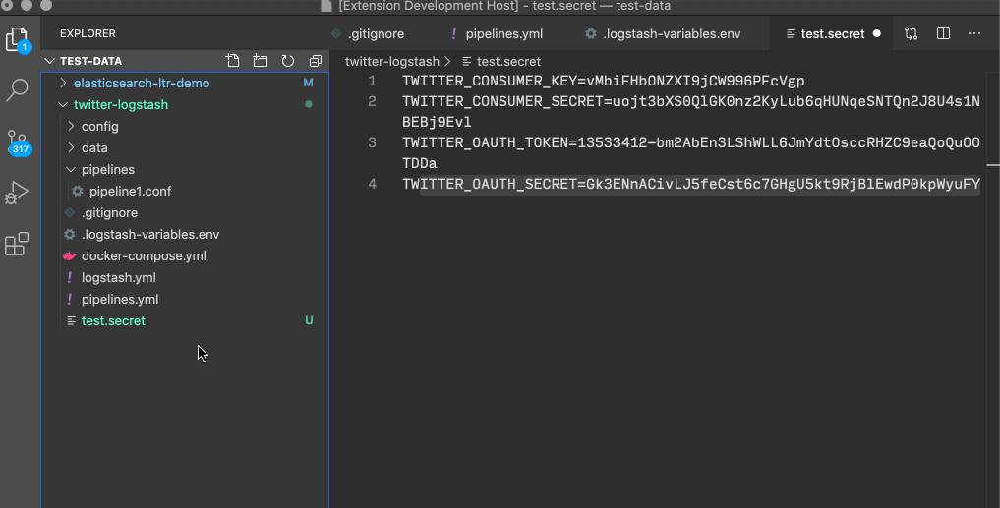

# vscode-openpgp README

This extensions implements OpenPGP in VSCode, allowing you to encrypt and decrypt files using public and private keys.

## Features

- No external dependencies: you don't have to install gpg on your machine in order to use this extension.
- Create Private Keys
- Encrypt with public keys
- Decrypt with private key
- Automatic selection of a matching private key based the encrypted message's signature

## Requirements

No requirements! OpenPGP uses [OpenPGP.js](https://openpgpjs.org/) from ProtonMail.

### 0.0.5

- Bump OpenPGP.js v4.10.9

### 0.0.4

- Automatic detection of private key if existing
- Displaying info about private key when asking for password

### 0.0.1

Initial release 

