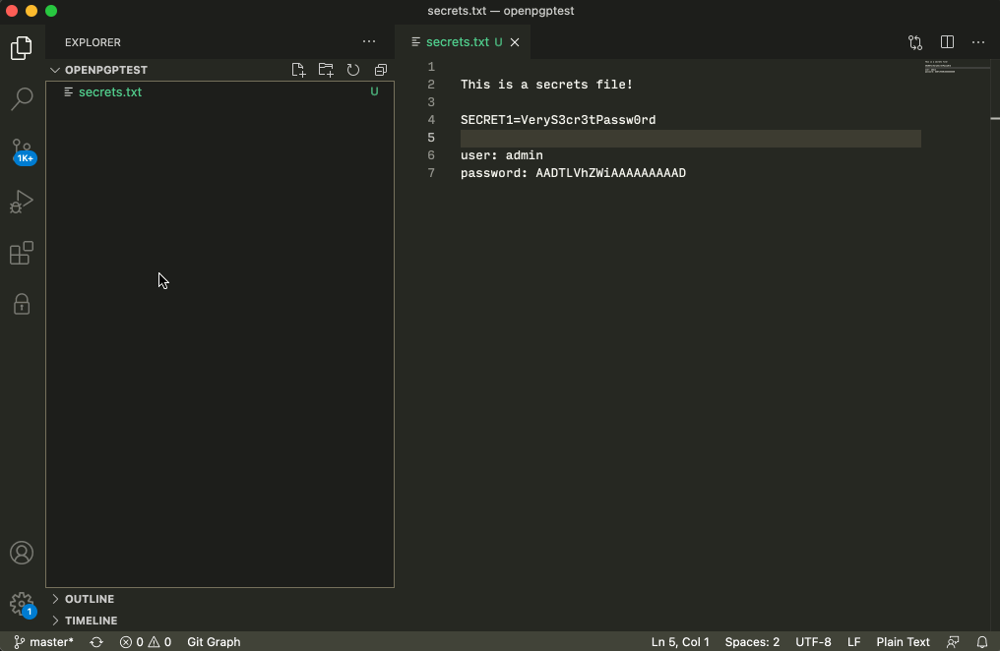

# OpenPGP Encryption for VSCode

This extensions implements OpenPGP in VSCode, allowing you to encrypt and decrypt files using public and private keys.

## Features

- No system's dependencies!
- Encrypt with public keys
- Decrypt with private key
- Create private keys
- Import public keys
- Automatic selection of a matching private key based the encrypted message's signature

### 0.0.8

- UI for adding private and public keys

### 0.0.7

- packaging fix 

### 0.0.5

- Bump OpenPGP.js v4.10.9
- Comment fix

### 0.0.4

- Automatic detection of private key if existing
- Displaying info about private key when asking for password

### 0.0.1

First release 

